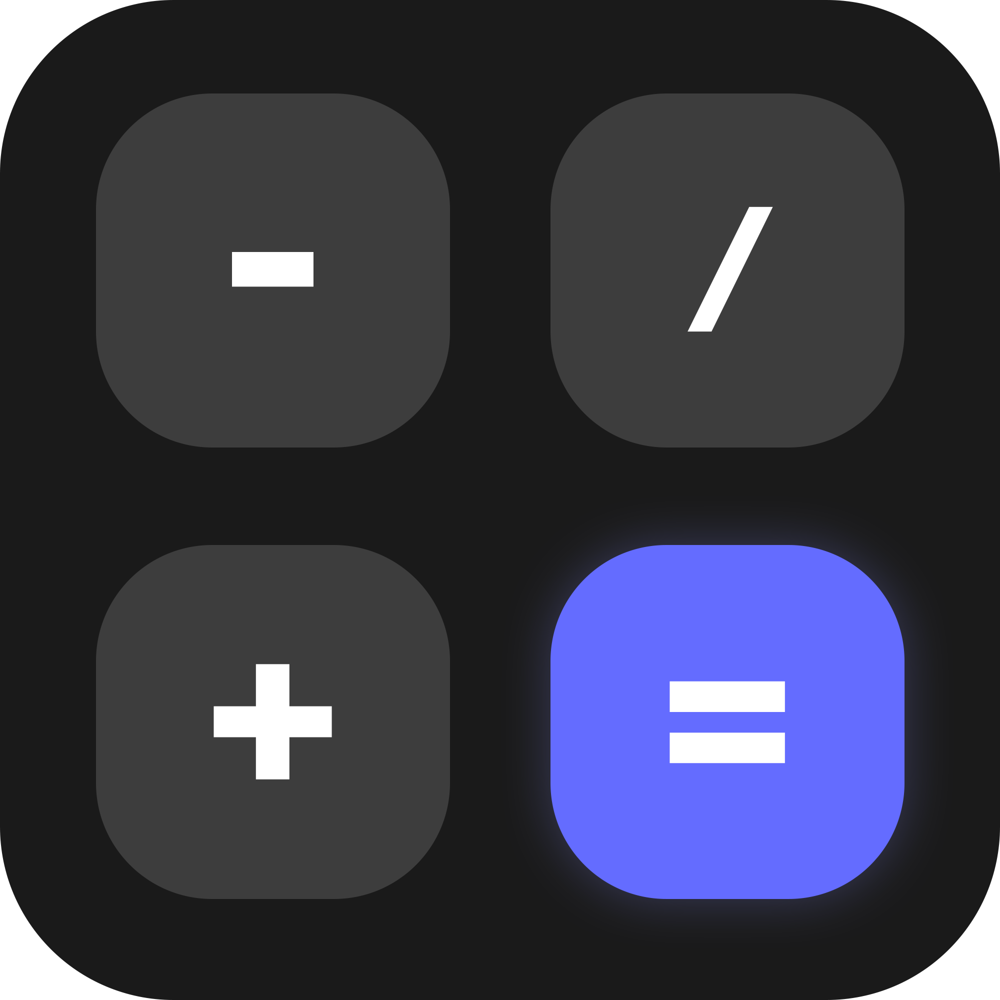

# YCalculator
***

YCalculator is a smooth, powerful and intuitive calculator developed using [Vite](https://vitejs.dev), [ReactJS](https://react.dev) and [SWC](https://swc.rs), apart from the [MathJS](https://mathjs.org) libraries.

 

<pre style="display: flex; justify-content: center;"><b>ToxYc 2023</b></pre>
